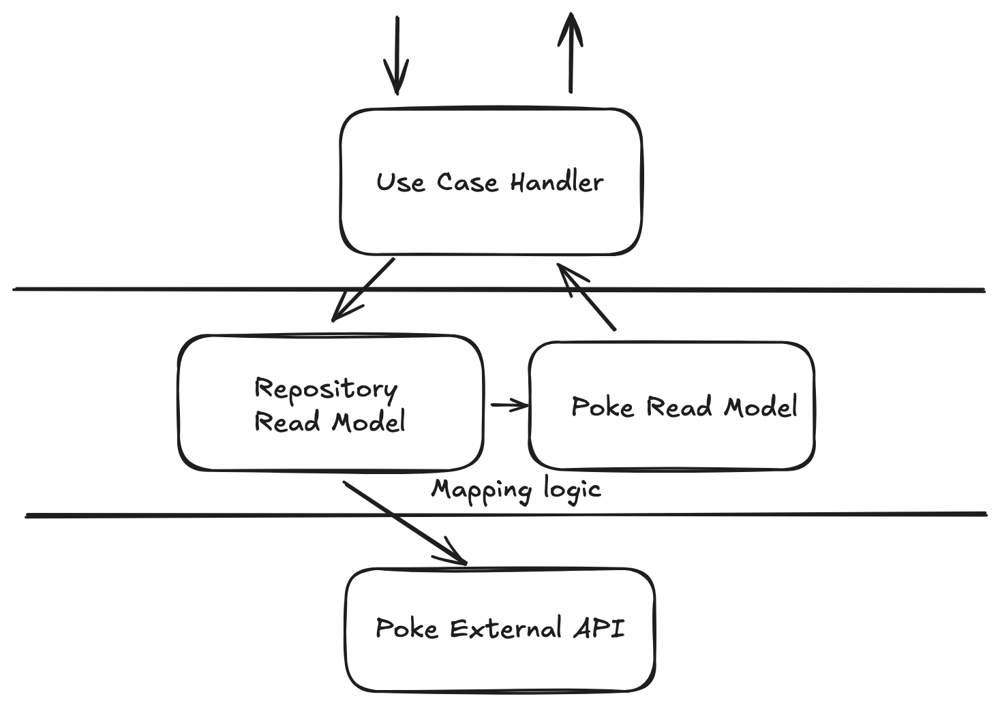

# Poke-Poke

## Software architecture
This project is structured with an emphasis on **domain-driven design** and **separation of concerns**. 
The architecture focuses on keeping business logic at the core while ensuring clear boundaries 
between operations that produce side effects and those that are side-effect-free. 
Inspired to CQRS model, so the read model allows to decouple external Pokemon Api responses
from internal representation of pokemon read model.



The read model abstraction allows to define some simple business logic
at domain level. For example in the exercise 2 the translator involves
a small piece of logic based on Pokemon status, like legendary flag
and habitat. By decoupling read model from external API model the whole
logic can be written and tested at domain level without any external strong
dependency.

## Tech stack
- Kotlin (functional enrichment with arrowkt)
- Gradle as build tool
- Spring boot to provide web service functionality

## Run Service
Run the service using docker-compose file, from repository root folder
```
docker compose up -d
```
This will produce an image `petretiandrea/poke-poke` and runs 
the service at 8080 port

## Build
- Docker 
The repository contains Dockerfile to build microservice image.
From root folder:
```
docker run -t <any_name> .
```

- Gradle to build project
```
gradlew :build
```

## Production and improvements tips

- add opentelemetry to service to improve observability
- add caching layer. The info returned by pokemon api are pretty static. Also, the whole pokemon translated is static.
- buy an apikey of translator to avoid rate limiting issue, also combined with caching.
- setup resiliency thins for external API call. 
Like retry on 5xx errors, rate-limiting or IO error.
- define and use a standard for API response when returns errors. Like [ProblemDetails](https://datatracker.ietf.org/doc/html/rfc7807)
- improve test coverage, actually only test over business logic and main paths are covered